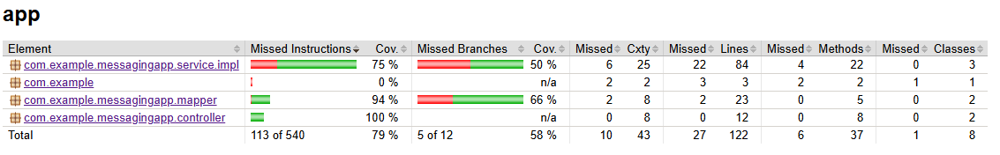

# Микросервис обработки сообщений

Микросервис на Java с использованием Spring Boot для обработки сообщений.

## Технологический стек

* **Java 17**
* **Spring Boot 3.1.5**
* **Spring Kafka** - для работы с Kafka
* **Spring Data JPA** - для ORM и доступа к данным
* **PostgreSQL** - в качестве хранилища данных
* **Lombok** - для уменьшения бойлерплейт-кода
* **Swagger/OpenAPI** - для документации API
* **Docker & Docker Compose** - для контейнеризации и оркестрации

## Инструкция по запуску проекта
1. Клонирование репозитория:   git clone https://github.com/vladimir-it-dev/bank-test-task.git
2. Запуск сервисов через Docker:   docker compose up -d
3. Все эндпоинты доступны через Swagger UI:   http://localhost:8080/swagger-ui.html
4. Используйте curl, Postman или любой другой HTTP-клиент для отправки и получения сообщений
5. Для мониторинга Kafka используйте Kafka UI:   http://localhost:8081
6. Логи приложения выводятся в консоль, а также пишутся в файл /logs/application.log.
7. Посмотреть логи через Docker:   docker logs messaging-app 

## Kafka Топики
Автоматически создаются при запуске:
1. input-messages (входящие сообщения)
2. output-messages (обработанные сообщения)

## Доступ к сервисам
- Сервис	     Порт	Описание
- Приложение -	 8080	Основное API
- Kafka UI	-    8081	Веб-интерфейс для мониторинга Kafka
- PostgreSQL -	 5433	База данных

## Работа с API
Доступные эндпоинты:
- `POST /api/messages` - Отправить новое сообщение
- `GET /api/messages` - Получить список всех сообщений
- `GET /api/messages/{id}` - Получить сообщение по ID
- `GET /api/statistics` - Получить статистику обработанных сообщений

## Форматы данных(пример)
#### Входящее сообщение (POST /api/messages) 

```json
{
  "id": "uuid-string",
  "content": "текст сообщения",
  "timestamp": "2023-01-01T12:00:00Z"
}
```

#### Ответ API 

```json
{
  "messageId": "uuid-string",
  "status": "PROCESSED",
  "processedAt": "2023-01-01T12:01:00Z"
}
```


